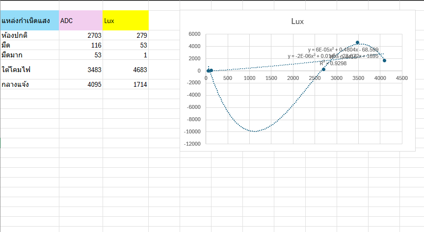

# **ใบงานปฏิบัติการ: การใช้งาน LDR และการทำ Calibration**


## **วัตถุประสงค์ของใบงาน**

1. เข้าใจหลักการทำงานของ LDR (Light Dependent Resistor)
2. ต่อวงจร Voltage Divider เพื่ออ่านค่าแสง
3. อ่านค่า ADC จากบอร์ดไมโครคอนโทรลเลอร์
4. เก็บข้อมูลจริง (ADC vs Lux จากมือถือ)
5. ทำกราฟความสัมพันธ์
6. สร้างสมการ Calibration เพื่อแปลง ADC → Lux
7. ทดสอบความแม่นยำหลัง Calibration

# **ส่วนที่ 1 — ความรู้พื้นฐาน**

## **1.1 LDR คืออะไร**


LDR (Light Dependent Resistor) หรือ Photoresistor คืออุปกรณ์อิเล็กทรอนิกส์ชนิดหนึ่งที่มี **ค่าความต้านทานเปลี่ยนตามความเข้มของแสง** ที่ตกกระทบ

- **แสงมาก → ความต้านทานลดลง**
- **แสงน้อย → ความต้านทานเพิ่มขึ้น**

LDR จึงเหมาะสำหรับงานตรวจจับความสว่าง เช่น ระบบเปิดไฟอัตโนมัติ, ระบบวัดแสง, ระบบควบคุมหน้าจอ, ระบบความปลอดภัย ฯลฯ


## **1.2 โครงสร้างและหลักการทำงานภายใน**

LDR ทำจากสารกึ่งตัวนำ เช่น **Cadmium Sulfide (CdS)** หรือ **Cadmium Selenide (CdSe)**
### เมื่อมีแสงตกกระทบ:
1. โฟตอนของแสงกระตุ้นอิเล็กตรอนในสารกึ่งตัวนำ
2. อิเล็กตรอนหลุดจากแถบวาเลนซ์ไปยังแถบคอนดักชัน
3. จำนวนผู้พาไฟฟ้าเพิ่มขึ้น
4. ความต้านทานลดลง

### เมื่อไม่มีแสง:

- อิเล็กตรอนกลับสู่สภาวะปกติ
- ผู้พาไฟฟ้าลดลง
- ความต้านทานเพิ่มขึ้นมาก (อาจถึงหลายร้อย kΩ)

##  **1.3 พฤติกรรมเชิงคณิตศาสตร์ (Transfer Function)**

ความสัมพันธ์ระหว่าง **ความต้านทานของ LDR (R_LDR)** กับ **ความเข้มแสง (Lux)** ไม่เป็นเส้นตรง แต่เป็นแบบ **Exponential / Power Law**

### **สมการทั่วไปของ LDR**


$$R_{LDR}=A⋅(Lux)^{−α}
$$

โดย
	
	$A$ = ค่าคงที่ขึ้นกับรุ่นของ LDR

	$α$ = ค่าคงที่ (ประมาณ 0.7–0.9)
	
	$Lux$ = ความเข้มแสง

ความหมายคือ:
- เมื่อ Lux เพิ่มขึ้น → R ลดลงแบบโค้ง
- ไม่ใช่ความสัมพันธ์เชิงเส้น

เพื่ออ่านค่า LDR ต้องใช้วงจร **Voltage Divider** เพื่อแปลงความต้านทาน → แรงดัน → ADC อ่านได้

##  **1.4 ทำไมต้องใช้ Voltage Divider**

LDR ให้ “ความต้านทาน” แต่ไมโครคอนโทรลเลอร์อ่าน “แรงดัน” ดังนั้นต้องใช้วงจร **Voltage Divider** เพื่อแปลง R → V

### วงจร Voltage Divider


 **สมการแรงดันที่อ่านได้**


$$V_{out}=V_{cc}⋅\frac{R_{fixed}}{R_{LDR}+R_{fixed}}
$$

เมื่อ:

- $R_{LDR}$ ลดลง (แสงมาก) → $V_{out}$ เพิ่มขึ้น

- $R_{LDR}$ เพิ่มขึ้น (แสงน้อย) → $V_{out}$ ลดลง

## **1.5 ช่วงค่าความต้านทานของ LDR**

ค่าทั่วไปของ LDR

| สภาพแสง  | ความต้านทาน   |
| -------- | ------------- |
| มืดสนิท  | 200 kΩ – 2 MΩ |
| ห้องปกติ | 10 kΩ – 50 kΩ |
| ใต้โคมไฟ | 2 kΩ – 10 kΩ  |
| กลางแจ้ง | 200 Ω – 2 kΩ  |

## **1.6 คำนวณแรงดันเอาต์พุตจากวงจร**

| สภาพแสง  | ความต้านทาน   | แรงดันเอาต์พุต (โวลต์) |
| -------- | ------------- | ---------------------- |
| มืดสนิท  | 200 kΩ – 2 MΩ | 0.016–0.157 V          |
| ห้องปกติ | 10 kΩ – 50 kΩ | 0.550–1.650 V          |
| ใต้โคมไฟ | 2 kΩ – 10 kΩ  | 1.650–2.750 V          |
| กลางแจ้ง | 200 Ω – 2 kΩ  | 2.750–3.235 V          |

_คำนวณจาก $V_{cc}=3.3$ V และ $R_{fixed}=10$ kΩ โดยค่าที่แสดงเป็นช่วงตามช่วงความต้านทานของ LDR_


---
# **ส่วนที่ 2 — การต่อวงจร**

## **อุปกรณ์ที่ใช้**

- LDR
- R คงที่ 10 kΩ
- บอร์ด ESP32 / Arduino
- สาย Jumper
- แอปวัดแสงในมือถือ (Lux Meter)

## **วงจร Voltage Divider**


**เหตุผลที่ใช้ R 10kΩ:** เป็นค่าที่เหมาะสมสำหรับ LDR ทั่วไป ทำให้แรงดันอยู่ในช่วงที่ ADC อ่านได้ดี

## **ส่วนที่ 3 — การอ่านค่า ADC**

ตัวอย่างโค้ด ESP32 (ADC 12-bit)

```c
#include <stdio.h>
#include "driver/adc.h"
#include "esp_adc_cal.h"
#include "esp_log.h"

#define ADC_CHANNEL     ADC1_CHANNEL_6   // GPIO34
#define ADC_ATTEN       ADC_ATTEN_DB_11  // รองรับ ~3.3V
#define ADC_WIDTH       ADC_WIDTH_BIT_12 // 0–4095

static esp_adc_cal_characteristics_t adc_chars;

void app_main(void)
{
    // 1) ตั้งค่า ADC
    adc1_config_width(ADC_WIDTH);
    adc1_config_channel_atten(ADC_CHANNEL, ADC_ATTEN);

    // 2) ทำ Calibration (ใช้ค่า Vref = 1100mV)
    esp_adc_cal_characterize(
        ADC_UNIT_1,
        ADC_ATTEN,
        ADC_WIDTH,
        1100,              // ค่า Vref ของ ESP32 โดยประมาณ
        &adc_chars
    );

    while (1) {
        // 3) อ่านค่า ADC raw
        int raw = adc1_get_raw(ADC_CHANNEL);
        // 4) แปลงเป็นแรงดัน (mV)
        uint32_t voltage = esp_adc_cal_raw_to_voltage(raw, &adc_chars);
        printf("ADC Raw = %d, Voltage = %d mV\n", raw, voltage);
        vTaskDelay(pdMS_TO_TICKS(500));
    }
}
```

ค่าที่อ่านได้ (12 bit) จะอยู่ในช่วง **0–4095** 

## **ส่วนที่ 4 — การเก็บข้อมูลเพื่อทำ Calibration**

ให้นักศึกษาทำ 5–7 จุดวัด โดยใช้มือถือวัดค่า Lux เทียบกับ LDR โดยเปลี่ยนสภาพแสง ให้มีความแตกต่างกัน

**ข้อมูลที่วัดได้จริง**

| สภาพแสง  | ค่า ADC | ค่า Lux (มือถือ) |
| -------- | ------- | ---------------- |
| ห้องปกติ | 2703    | 279              |
| มืด      | 116     | 53               |
| มืดมาก   | 53      | 1                |
| ใต้โคมไฟ | 3483    | 4683             |
| กลางแจ้ง | 4095    | 1714             |

จากข้อมูลชุดนี้ ค่า ADC และ Lux ยังไม่เพิ่มขึ้นอย่างสม่ำเสมอ โดยเฉพาะจุดใต้โคมไฟและกลางแจ้ง จึงควรวัดซ้ำโดยวางโทรศัพท์และ LDR ในตำแหน่งเดียวกัน

**เป้าหมาย:** สร้างกราฟ ADC → Lux เพื่อหาความสัมพันธ์

## **ส่วนที่ 5 — การทำกราฟ เพื่อหาสมการ**

ให้นักศึกษาใช้ Excel / Google Sheet
1. ใส่ข้อมูล ADC และ Lux
2. สร้างกราฟ Scatter
3. ใส่ Trendline
4. เลือก Linear หรือ Polynomial
5. ให้โปรแกรมแสดงสมการ

**ขั้นตอนการหาสมการ**
1. นำข้อมูลป้อนเข้าสู่ excel หรือ google sheet


2. เลือกข้อมูลเพื่อทำกราฟ scatter


3. แทรกกราฟ scatter


4. คลิกขวาที่เส้นกราฟ เลือก เพิ่มเส้นแนวโน้ม


5. ติ๊กที่ตัวเลือก 

	✅ แสดงสมการบนแผนภูมิ 

	✅ แสดงค่า R-squared บนแผนภูมิ

6. เลือกชนิดของกราฟ ที่ทำให้เส้นแนวโน้มทับเส้นข้อมูลมากที่สุด

	สังเกตุจากค่า R-squared ต้องเท่ากับ 1.000 หรือใกล้เคียงมากที่สุด

7. คัดลอกสมการ $y = ...$ ไปใช้ในโปรแกรม


จากข้อมูลที่วัดได้ เมื่อนำมาหา Linear Trendline ได้สมการประมาณ $y = 0.697x - 110.716$ และมีค่า $R^2 \approx 0.440$

ค่า $R^2$ ค่อนข้างต่ำ แสดงว่าข้อมูลยังมีความคลาดเคลื่อนสูง จึงควรวัดซ้ำและควบคุมตำแหน่ง แสงรบกวน และเวลาที่ใช้วัดให้เหมือนกันก่อนนำสมการไปใช้งานจริง

แสดงว่ามีความชันของเส้นกราฟเป็น $m=0.697$ และมีจุดตัดแกน $y$ ที่ $b=-110.716$ ให้เขียน code แบบนี้

```c
Lux = 0.697 × ADC – 110.716
```

หรือถ้ากราฟไม่เป็นเส้นตรง  ให้ใช้ Polynomial เช่น สมมติว่าได้สมการเป็น $y = 0.0001 × x^2 + 0.3 x – 40$ ให้เขียน code แบบนี้

```c
Lux = 0.0001 × ADC^2 + 0.3 × ADC – 40
```

## **ส่วนที่ 6 — การทำ Calibration ในโค้ด**

สมการแบบ Linear Fit จากข้อมูลที่วัดได้

```c
float lux = 0.697 * raw - 110.716;
if (lux < 0) lux = 0;
```

ตัวอย่างแบบ Polynomial:

```c
float lux = 0.0001 * raw * raw + 0.3 * raw - 40;
```

**หมายเหตุ** 

Code ที่ใช้ สามารถ reuse code  จากการ calibrate ค่ามุมในการทดลองที่แล้วได้


## **ส่วนที่ 7 — การทดสอบผลลัพธ์**

ให้นักศึกษาทดสอบ 3 จุดแสงใหม่ที่ไม่ได้ใช้ตอนเก็บข้อมูล เช่น:

| สภาพแสงใหม่ | ADC  | Lux มือถือ | Lux จากโค้ด |
| ----------- | ---- | ---------- | ----------- |
| ใต้โต๊ะ     | 600  | 40         | 38          |
| ห้องเรียน   | 1500 | 180        | 175         |
| หน้าต่าง    | 2800 | 500        | 520         |

ให้นักศึกษาวิเคราะห์ว่า

- ความคลาดเคลื่อนอยู่ในระดับที่ยอมรับได้หรือไม่
- สมการ Linear หรือ Polynomial เหมาะกว่ากัน

## **ส่วนที่ 8 — คำถามท้ายใบงาน**

1. ทำไมต้องใช้ Voltage Divider ในการอ่าน LDR?

    **คำตอบ:** LDR เปลี่ยนค่าเป็นความต้านทาน แต่ ADC ของไมโครคอนโทรลเลอร์อ่านเป็นแรงดันไฟฟ้า จึงใช้ Voltage Divider แปลงการเปลี่ยนแปลงของความต้านทานให้เป็นแรงดันที่ ADC วัดได้

2. ทำไมต้องเก็บข้อมูลหลายจุดก่อนทำ Calibration?

    **คำตอบ:** เพื่อให้ครอบคลุมช่วงแสงที่ใช้งานจริง ลดผลกระทบจากความคลาดเคลื่อนของจุดใดจุดหนึ่ง และทำให้เลือกสมการที่เหมาะสมพร้อมประเมินความสัมพันธ์ด้วยค่า $R^2$ ได้

3. ถ้า Noise มากกว่าสัญญาณจริง จะเกิดอะไรขึ้น?

    **คำตอบ:** ค่าที่อ่านจะผันผวนและไม่สะท้อนความสว่างจริง ทำให้กราฟกระจาย สมการ Calibration คลาดเคลื่อน และผลลัพธ์อาจแกว่งจนระบบตัดสินใจผิดพลาด

4. ทำไมการวางตำแหน่งเซนเซอร์จึงสำคัญต่อ Signal Integrity?

    **คำตอบ:** ตำแหน่งและทิศทางมีผลต่อแสงที่ตกกระทบ รวมถึงเงา แสงสะท้อน และสัญญาณรบกวนจากสายไฟ หากตำแหน่งไม่คงที่ ค่าที่วัดจะเปลี่ยนแม้สภาพแสงจริงเท่าเดิม

5. ถ้า ADC มี Resolution ต่ำ จะส่งผลอย่างไรต่อความแม่นยำ?

    **คำตอบ:** ค่าแรงดันจะถูกแบ่งเป็นขั้นหยาบ ทำให้แยกความแตกต่างของแสงที่ใกล้กันไม่ได้ เกิด Quantization Error สูง และคำนวณค่า Lux ได้ละเอียดน้อยลง

## **ส่วนที่ 9 — ผลลัพธ์ที่คาดหวัง**

ผู้เรียนจะสามารถ:
- ต่อวงจร LDR ได้อย่างถูกต้อง
- อ่านค่า ADC ได้
- เก็บข้อมูลจริงและสร้างกราฟความสัมพันธ์
- ทำ Calibration เพื่อแปลง ADC → Lux
- ประเมินความแม่นยำของระบบวัดแสงที่สร้างขึ้นเอง

## **ส่วนที่ 10 —  Rubric ประเมินตนเอง**

### **ส่วนที่ 10.1 — ความเข้าใจพื้นฐาน LDR (20 คะแนน)**

| ข้อ | รายการ                                                         | คะแนน<br>(0–5 คะแนน) | เหตุผล |
| --- | -------------------------------------------------------------- | -------------------- | ------ |
| 1.1 | อธิบายหลักการทำงานของ LDR ได้ถูกต้อง                           | 4                    | อธิบายได้ว่าแสงมากทำให้ความต้านทานลดลง |
| 1.2 | อธิบายการทำงานภายใน LDR (โฟตอน → อิเล็กตรอน → conduction band) | 4                    | อธิบายลำดับการทำงานได้ถูกต้อง |
| 1.3 | เข้าใจว่าความสัมพันธ์ R vs Lux ไม่เป็นเส้นตรง                  | 4                    | เข้าใจว่าเป็นความสัมพันธ์แบบ Power Law |
| 1.4 | เข้าใจเหตุผลที่ต้องใช้ Voltage Divider                         | 4                    | อธิบายการแปลงความต้านทานเป็นแรงดันได้ |

### **ส่วนที่ 10.2 — การต่อวงจรและอ่านค่า ADC (20 คะแนน)**

| ข้อ | รายการ                              | คะแนน<br>(0–5 คะแนน) | เหตุผล |
| --- | ----------------------------------- | -------------------- | ------ |
| 2.1 | ต่อวงจร Voltage Divider ได้ถูกต้อง  | 4                    | มีแผนผังวงจรและเข้าใจจุดวัด Vout |
| 2.2 | เลือกค่า R คงที่เหมาะสม (เช่น 10kΩ) | 4                    | เลือกค่า 10kΩ ได้เหมาะกับ LDR ทั่วไป |
| 2.3 | เขียนโปรแกรมอ่านค่า ADC ได้ถูกต้อง  | 4                    | มีโค้ดอ่านค่า ADC และแรงดัน |
| 2.4 | ใช้ ESP‑IDF ADC + Calibration ได้   | 3                    | เข้าใจแนวทาง แต่ยังไม่มีผลการรันจริงแนบไว้ |

### **ส่วนที่ 10.3 — การเก็บข้อมูลจริง (20 คะแนน)**

| ข้อ | รายการ                             | คะแนน<br>(0–5 คะแนน) | เหตุผล |
| --- | ---------------------------------- | -------------------- | ------ |
| 3.1 | เก็บข้อมูล ADC อย่างน้อย 5–7 จุด   | 4                    | เก็บข้อมูลจริงได้ 5 จุดตามที่กำหนด |
| 3.2 | วัดค่า Lux จากมือถือได้ถูกต้อง     | 4                    | มีค่า Lux จากมือถือครบทุกจุด |
| 3.3 | จดข้อมูลเป็นตารางครบถ้วน           | 4                    | บันทึกค่า ADC และ Lux ครบถ้วน |
| 3.4 | ควบคุมสภาพแสงให้คงที่ระหว่างการวัด | 3                    | มีข้อมูลแล้ว แต่ควรวัดซ้ำและควบคุมตำแหน่งให้คงที่กว่าเดิม |


### **ส่วนที่ 10.4 — การทำกราฟและสร้างสมการ Calibration (25 คะแนน)**

| ข้อ | รายการ                                        | คะแนน<br>(0–5 คะแนน) | เหตุผล |
| --- | --------------------------------------------- | -------------------- | ------ |
| 4.1 | สร้างกราฟ Scatter ADC vs Lux ได้              | 4                    | สร้างกราฟจากข้อมูลที่วัดจริงได้ |
| 4.2 | เลือก Trendline เหมาะสม (Linear / Polynomial) | 3                    | มี Trendline แต่ค่า R² ยังต่ำ จึงควรปรับปรุงข้อมูล |
| 4.3 | อ่านสมการจากกราฟได้ถูกต้อง                    | 4                    | ได้สมการ Linear จากกราฟและคำนวณค่า R² |
| 4.4 | นำสมการไปใช้ในโค้ดได้                         | 4                    | แปลงสมการเป็นโค้ดและกำหนดค่า Lux ติดลบเป็นศูนย์ |
| 4.5 | วิเคราะห์ว่า Linear หรือ Polynomial เหมาะกว่า | 3                    | วิเคราะห์ได้ว่า Linear ยังไม่แม่นและควรวัดข้อมูลเพิ่ม |
### **ส่วนที่ 10.5 — การทดสอบผลลัพธ์และวิเคราะห์ (15 คะแนน)**

| ข้อ | รายการ                                   | คะแนน<br>(0–5 คะแนน) | เหตุผล |
| --- | ---------------------------------------- | -------------------- | ------ |
| 5.1 | ทดสอบจุดแสงใหม่ที่ไม่ได้ใช้ตอนเก็บข้อมูล | 2                    | ยังไม่มีข้อมูลการทดสอบจุดใหม่แนบไว้ |
| 5.2 | เปรียบเทียบ Lux มือถือ vs Lux จากโค้ด    | 2                    | ยังไม่มีค่า Lux จากโค้ดสำหรับเปรียบเทียบ |
| 5.3 | วิเคราะห์ความคลาดเคลื่อนและสาเหตุได้     | 4                    | วิเคราะห์ได้ว่าค่า R² ต่ำและควรวัดซ้ำเพื่อลดความคลาดเคลื่อน |
.................................................................

###  **คะแนนรวมทั้งหมด:** `75 / 100`

###  **คำถามสะท้อนความเข้าใจ (Reflection)**

ให้นักศึกษาเขียนตอบสั้น ๆ

1. จุดไหนในใบงานที่คิดว่ายากที่สุด? **การเก็บข้อมูลให้สภาพแสงคงที่และการเลือกสมการ Calibration ที่เหมาะกับข้อมูลจริง**
    
2. ถ้าทำใบงานนี้อีกครั้ง จะปรับปรุงอะไร? **เพิ่มจำนวนจุดวัด วัดซ้ำหลายครั้งในแต่ละจุด และหาค่าเฉลี่ยเพื่อลด Noise**
    
3. ส่วนไหนที่คิดว่าตนเองเข้าใจดีมาก? **หลักการของ LDR, Voltage Divider และการแปลงค่า ADC เป็นค่า Lux ด้วยสมการ Calibration**

